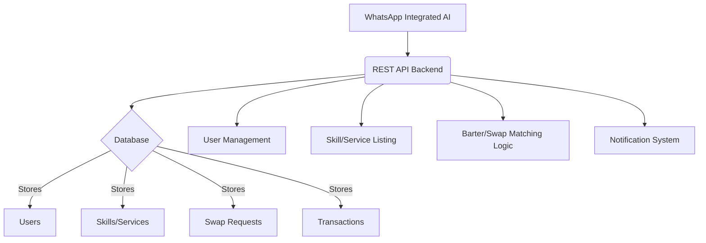

# Skill-Swap MCP Server Development Roadmap

## 1. Project Overview

**App Idea:** To build a Multi-Chain Protocol (MCP) server that functions as a barter system, specifically a "skill-swap" platform. This server will facilitate the exchange of skills and services between users.

**Integration:** The MCP server will be utilized by an existing WhatsApp integrated AI. This AI will serve as the primary interface for users to interact with the skill-swap system, sending requests to our backend and receiving responses.

## 2. Core Features

The following core features will be implemented in the MCP server:

*   **User Management:**
    *   User registration and profile creation.
    *   Authentication and authorization for secure access.
    *   Ability to view and update personal profiles.
*   **Skill/Service Listing:**
    *   Users can list skills they offer (e.g., Python tutoring, graphic design, language lessons).
    *   Users can list skills/services they are looking for (e.g., help with web development, photography services).
    *   Categorization and search functionality for skills.
*   **Barter/Swap Request Management:**
    *   Users can initiate swap requests with other users based on offered and desired skills.
    *   Ability to accept, decline, or negotiate swap requests.
    *   Tracking the status of ongoing and completed swaps.
*   **Barter/Swap Matching Logic:**
    *   Intelligent matching system to suggest potential swap partners based on complementary skills.
    *   Consideration of user preferences and availability.
*   **Notification System:**
    *   Real-time notifications for new swap requests, accepted/declined requests, and other relevant updates.
    *   Integration with the WhatsApp AI for delivering notifications to users.
*   **Rating and Review System (Future Enhancement):**
    *   Allow users to rate and review each other after a completed swap to build trust and reputation.

## 3. Architectural Overview

The system will be built as a custom web application with a RESTful API backend.

**Explanation:**

*   **WhatsApp Integrated AI:** The existing component that interacts with our backend by sending requests and receiving responses.
*   **REST API Backend:** The core of our skill-swap system, exposing endpoints for various functionalities.
*   **Database:** A relational database will store all application data.
*   **User Management:** Handles user registration, profiles, authentication, and authorization.
*   **Skill/Service Listing:** Allows users to list their skills, services they offer, and services they are looking for.
*   **Barter/Swap Matching Logic:** Facilitates the matching of users based on their offered and desired skills.
*   **Notification System:** Manages notifications for swap requests, matches, and other relevant events, integrating with the WhatsApp AI for delivery.

## 4. Technology Stack

*   **Backend Framework:** Express.js (Node.js)
*   **Database:** PostgreSQL

## 5. Development Steps (Todo List)

This is a detailed breakdown of the development process:

1.  **Define Core Entities and their Attributes:** (Completed)
    *   **User:** `id`, `whatsapp_id`, `name`, `contact_info`, `bio`, `skills_offered`, `skills_desired`, `reputation_score` (future).
    *   **Skill:** `id`, `name`, `description`, `category`.
    *   **Swap Request:** `id`, `requester_user_id`, `responder_user_id`, `offered_skill_id`, `desired_skill_id`, `status` (pending, accepted, declined, completed), `created_at`, `updated_at`.
    *   **Transaction (Completed Swap):** `id`, `swap_request_id`, `user1_id`, `user2_id`, `skill1_exchanged_id`, `skill2_exchanged_id`, `completed_at`, `rating_user1_to_user2`, `review_user1_to_user2`, `rating_user2_to_user1`, `review_user2_to_user1` (future).

2.  **Choose a Backend Framework and Database Technology:** (Completed)
    *   Backend: Express.js (Confirmed)
    *   Database: PostgreSQL
3.  **Set up the Basic Project Structure for the Backend:**
    *   Initialize Node.js project.
    *   Install Express.js and other necessary dependencies.
    *   Set up basic server file and routes.
    *   Configure database connection.

4.  **Implement User Authentication and Profile Management:**
    *   Create user model/schema.
    *   Develop API endpoints for user registration (`POST /api/users/register`).
    *   Implement API endpoints for user login/authentication (if needed for direct access, otherwise WhatsApp AI handles initial user identification).
    *   Create API endpoints for retrieving and updating user profiles (`GET /api/users/:id`, `PUT /api/users/:id`).

5.  **Implement API Endpoints for Skill/Service Listing:**
    *   Create skill model/schema.
    *   Develop API endpoints for adding new skills (`POST /api/skills`).
    *   Implement API endpoints for retrieving skills (e.g., `GET /api/skills`, `GET /api/skills/user/:userId`).
    *   Add functionality to update and delete skills.

6.  **Implement API Endpoints for Creating and Managing Swap Requests:**
    *   Create swap request model/schema.
    *   Develop API endpoint for initiating a swap request (`POST /api/swaps`).
    *   Implement API endpoints for accepting/declining a swap request (`PUT /api/swaps/:id/accept`, `PUT /api/swaps/:id/decline`).
    *   Create API endpoints for retrieving user-specific swap requests (`GET /api/users/:userId/swaps`).

7.  **Develop the Barter/Swap Matching Logic:**
    *   Implement algorithms to suggest potential matches based on skills offered and desired.
    *   Consider factors like location (if applicable), availability, and skill categories.
    *   This might involve a dedicated service or module within the backend.

8.  **Integrate with the WhatsApp AI (API Calls):**
    *   Define the specific API contract (request/response formats) between our backend and the WhatsApp AI.
    *   Ensure our API endpoints are accessible and properly secured for the WhatsApp AI.
    *   Implement any necessary webhook configurations if the WhatsApp AI pushes updates to our server.

9.  **Implement a Notification System:**
    *   Set up a mechanism to trigger notifications (e.g., when a swap request is received, accepted, or completed).
    *   Integrate with the WhatsApp AI's messaging API to send these notifications to users via WhatsApp.

10. **Testing and Deployment:**
    *   Write unit and integration tests for all API endpoints and business logic.
    *   Set up a continuous integration/continuous deployment (CI/CD) pipeline.
    *   Deploy the application to a cloud platform (e.g., AWS, Heroku, DigitalOcean).

## 6. Next Steps

Once this roadmap is approved, the next step will be to set up the basic project structure for the Express.js backend.